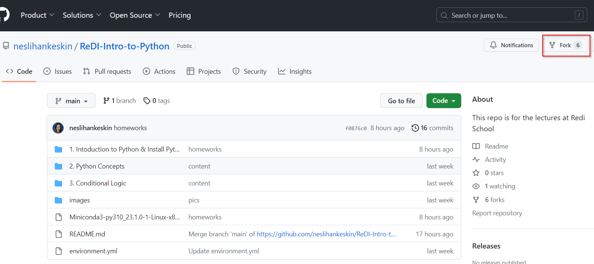
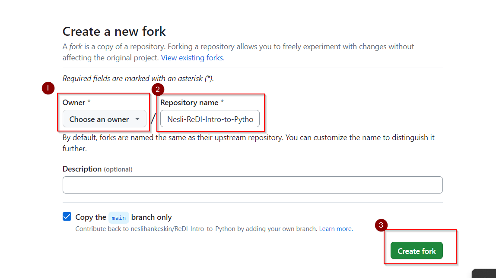
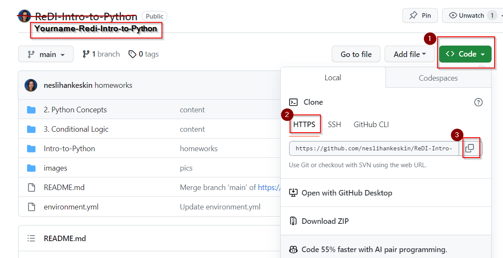
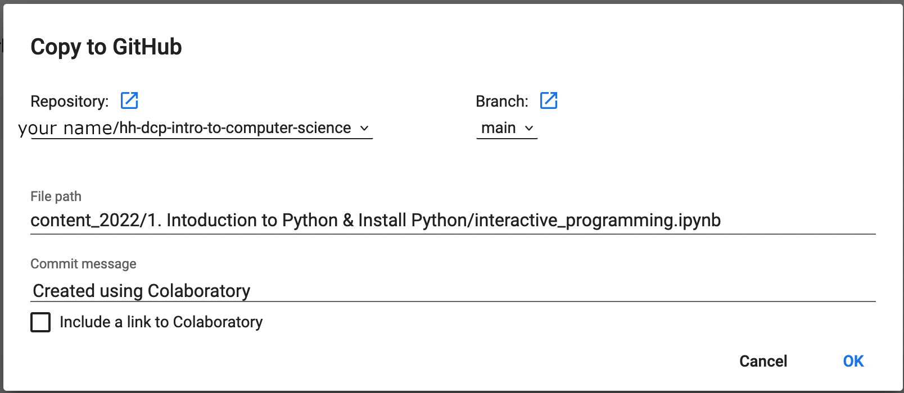

# Homework Instructions

## Pre Requisites

- You need a GitHub account and have your credentials ready.
- Complete the steps which were defined in "Python Tool Setup & Installation" https://github.com/neslihankeskin/ReDI-Intro-to-Python/tree/main#python-tool-setup-and-installation. In case you face any issues, write me your issue via Slack message with the screenshot and the step number that you are stuck, and only complete Step 1.
- Create Git Personal Access Tokens (Classic) [https://docs.github.com/en/authentication/keeping-your-account-and-data-secure/managing-your-personal-access-tokens](https://docs.github.com/en/authentication/keeping-your-account-and-data-secure/managing-your-personal-access-tokens#creating-a-personal-access-token-classic) Do not lose your token this is your password.


## Additional Task
- Start Udacity free course about [Git essential](https://www.udacity.com/course/version-control-with-git--ud123), your deadline is 06.11.2023.


## Step 1 - Google Colab

Open [Redi-Intro-to-Python](https://github.com/neslihankeskin/ReDI-Intro-to-Python)
and sign into your GitHub account.

On the GitHub page for this project, klick on the -button to prepare your own copy 
to store your changes afterwards. 



Update the name by adding your name as prefix and press "Create fork".



Now you 'own' a copy of 'Redi-Intro-to-Python' in your GitHub.
Henceforth, you will use your copy's URL to checkout the code.




### Open the Homework file
[https://colab.research.google.com/?hl=en](https://colab.research.google.com/?hl=en)

There you can open the menu "file/open notebook". In the pop-up window select the "GitHub" tab. 
You need to grant "Google Colaboratory" in the following dialogs by entering your GitHub credentials.

Select the 'Yourname-ReDi-Intro-to-Python' repository in the drop down menu and klick on the 
"Homework1-Google_Colab.ipynb" jupyter notebook. Jupyter notebooks have the file extension '.ipynb'


You can edit the Page content and execute the code blocks. Colab may issue a security warning, which you may accept at your own peril.


### save notebook files
If you want to save your work for later (highly recommended), select the "File/Save a copy in GitHub" menu item.
You can keep most presets, but please enter something meaningful as a "Commit message", as this will help you later to 
understand the goal of the change. Press "OK"  

This will create a new version of the file in your copy of the GitHub project. 

## Step 2 - Jupyter Lab

### Step 2.1 Clone Github repo
Now, you will clone the repo that you forked previously. Note: We practiced cloning the repository Redi-Intro-to-Python. However, you do not have permission to push changes for that repo, so that you should clone one of your own repositories to exercise git commands.
Go to Windows Terminal, make sure that you opened Ubuntu shell
You will see ```(base) root@desktopname:~$```
Run ```git clone [link to your forked repo] ``` for example ```git clone https://github.com/neslihankeskin/ReDI-Intro-to-Python.git``` please replace the link with your own repository which you forked.
This will create a local version of this repository on your computer. In the same way, you can clone any git repository by changing the address.
Run ```ls```. This will list all files and directories in your computer and you should now see a new folder called "Yourname-ReDI-Intro-to-Python".
Run ```cd Yourname-ReDI-Intro-to-Python```. This will show you the files in this directory.
### Step 2.2 Run JupyterLab
On Windows Terminal, you should see ```(base) root@desktopname:~/Yourname-ReDI-Intro-to-Python$``` now activate your environment.
Run ``conda activate intro-to-python`` now you should see ```(intro-to-python) root@desktopname:~/Yourname-ReDI-Intro-to-Python$```
Run ``jupyter lab``. Ctrl + Click on the link to start with ``http://localhost...``` This will launch JupyterLab, and it will redirect you to your default browser. You can now work with notebooks (".ipynb" format) in JupyterLab. Please find and open the Homework1-JupyterLab.ipynb file on the left side under file browser under 2-Python-Tools folder and enter your answers on this file and then save it.
Note: **DO NOT CLOSE** your Windows Terminal during your work with JupyterLab.
Once you are done with the homework save the file on JupyterLab

Note: A Jupyter notebook consists of cells. The two main types of cells you will use are **code cells** and **markdown cells**.
- **Code Cells** are for Python script and if you want to execute the code in a code cell, hit Enter while holding down the Shift key (denoted Shift + Enter). Note that code cells are executed in the order you shift-enter them. That is to say, the ordering of the cells for which you hit Shift + Enter is the order in which the code is executed.
- **Markdown Cells** contain text. The text is written in markdown Hitting Shift + Enter renders the text in the formatting you specify.

Watch this tutorial for further about Jupyter Lab.

## Step 3 - VSC
### Step 3.1 Clone github repo
Skip this step if you already done Step 2.1, if not Do Step 2.1.
### Step 3.2 Run VSC
On Windows Terminal, you should see ```(base) root@desktopname:~/Yourname-ReDI-Intro-to-Python$```. If not, you can close and open a new Windows terminal and run ```cd Yourname-ReDI-Intro-to-Python```.
Run ``code .``. This will open VSC. Note: it might take some time to install the VS Code Server if you run the command for the first time.
On VSC, open a new terminal and make sure it is a bash shell. Now activate your environment. Run ``conda activate intro-to-python`` now you should see ```(intro-to-python) root@desktopname:~/Yourname-ReDI-Intro-to-Python$```
On file browser find Homework1-VSC.py follow the questions and write your answers then run the file and see the outcome on the terminal window. Once you are done on the Bash shell run ```git add .```, ``git commit -m "your message for changes"``, and ``git push``. Now if you go back to github page you will see your changes deployed to the repository of yours. 


